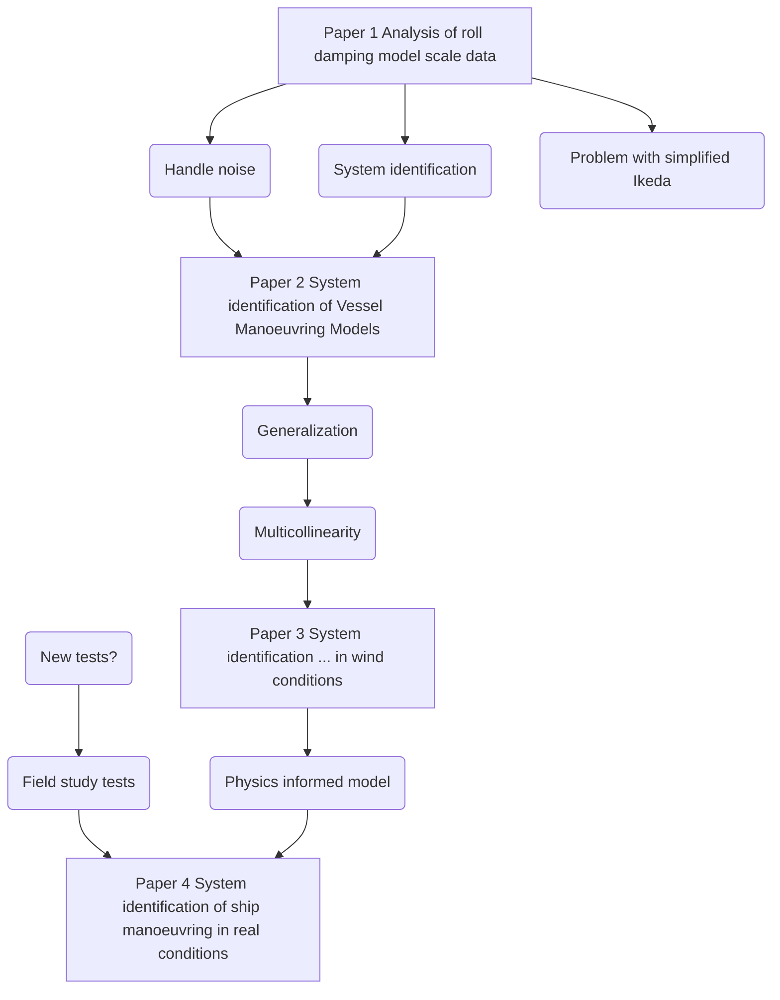

This note is describing the "read thread" through my PhD research.

Here are the the papers and theses with me as first author till today:
```dataview  
TABLE
title as Title,  
itemType as Item,  
year as Year,
contribution as Contribution
WHERE FirstAuthor = "Alexandersson, Martin" AND itemType != "dataset"  
SORT Year ASC, Date ASC
```
---

The following datasets have also been published:
```dataview  
TABLE
title as Title,  
itemType as Item,  
contribution as Contribution  
WHERE FirstAuthor = "Alexandersson, Martin" and itemType = "dataset"  
SORT Date ASC
```

The licentiate thesis [[@alexanderssonTHESISDEGREELICENTIATE2022]] consisted of the following to papers:
```dataview  
TABLE
title as Title,  
itemType as Item,  
contribution as Contribution  
WHERE contains(tags, "lic_paper")  
SORT Year Asc, Date ASC
```

# Summary
Machine learning (ML) was a very hot topic when this PhD project started in January 2020. My initial hypothesis was that if we could just gather enough data – fantastic prediction models could be created with ML. I also realized that I was in a very good position to do it – having worked almost 10 years gathering and analysing dynamic time series data from the maritime dynamics laboratory (MDL) at the RISE SSPA Maritime Center. The objective was to build ML prediction models of the ship dynamics, addressing the whole seakeeping and manoeuvring problem. It was however decided to start with something simpler, only focusing on one degree of freedom – roll. 

Structure and workflow of the appended papers to achieve the thesis objectives.


[[Paper 1 Analysis of roll damping model scale data]]
[[Paper 2 System identification of Vessel Manoeuvring Models]]
[[Paper 3 System identification of a physics informed ship model for better predictions in wind conditions]]
[[Paper 4]]

```todoist
name: PhD ToDo
filter: "#PhD"
```

